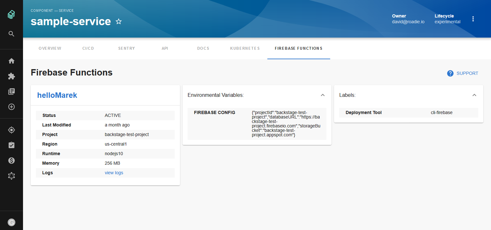

# Firebase Functions Plugin for Backstage



[https://roadie.io/backstage/plugins/firebase-functions](https://roadie.io/backstage/plugins/firebase-functions)

## Features

- Display firebase functions details
- link to overview or logs in the cloud google platform console

## How to add firebase-functions project dependency to Backstage app

If you have your own backstage application without this plugin, here it's how to add it:

1. In the `backstage/packages/app` project add the plugin as a `package.json` dependency:

```bash
yarn add @roadiehq/backstage-plugin-firebase-functions
```

2. Add plugin to the list of plugins:

```ts
// packages/app/src/plugins.ts
export { plugin as FirebaseFunctionsPlugin } from '@roadiehq/backstage-plugin-firebase-functions';
```

3. Add plugin to the `entitytPage.tsx` source file:

```tsx
// packages/app/src/components/catalog/EntityPage.tsx
<EntityPageLayout.Content
  path="/firebase-functions/*"
  title="Firebase Functions"
  element={<FirebaseFunctionsRouter entity={entity} />}
/>
```

## How to use Firebase-functions plugin in Backstage

To start using it for your component, you have to:

1. add annotation to the yaml config file of a component:

```yml
cloud.google.com/function-ids: projects/<project-name>/locations/<region-name>/functions/<function-name>
```

## Develop plugin locally

You can clone the plugin repo into the `packages/` directory:

```sh
git clone https://github.com/RoadieHQ/backstage-plugin-firebase-functions.git firebse-functions
```

and run `yarn` in the root backstage directory - it will create a symbolic link so the dependency will be provided from the source code instead of node_modules package.

## Links

- [Backstage](https://backstage.io)
- [Further instructons](https://roadie.io/backstage/plugins/firebase-functions/)
- Get hosted, managed Backstage for your company: https://roadie.io
